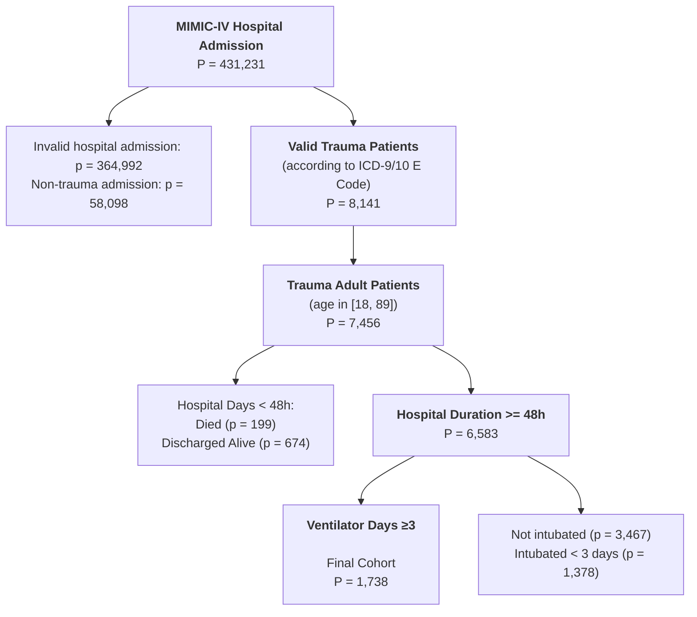

# MIMIC-IV Trauma Cohort — Paper-style Flow  

Flow style follows the reference MIMIC-III diagram, adapted to MIMIC-IV.  
E-codes: clean pre-normalized ICD-9/ICD-10 exact allowlist from workbook.  
ICD-10 excluded rows were removed before workbook ingestion; extractor applies no workbook exclude column.  
Age: 18–89 | LOS: &ge;48h | Vent: &ge;3d  

## 1. Cohort Flow

## 2. Paper-style Layer Table

| Step | Rule | HADM/P | ICU stays in step | Exclusion shown at this step |
|---|---|---:|---:|---|
| Hospital Admission | all MIMIC-IV hospital admissions | 431231 | 73181 | invalid hospital admission: 364992; non-trauma admission: 58098 |
| Valid Trauma Patients | valid hospital admission + ICD-9/10 E-code evidence from workbook | 8141 | 9135 | age excluded: 685 |
| Trauma Adult Patients | age_at_admit between 18 and 89 | 7456 | 8381 | hospital days &lt; 48h: 873 |
| Hospital Duration &gt;= 48h | adult trauma + hospital_los_hours >= 48 | 6583 | 7507 | not intubated: 3467; intubated &lt; 3d: 1378 |
| Ventilator Days ≥3 | hospital duration + invasive ventilator days >= 3 | 1738 | 2232 | final cohort |

## 3. Internal Mapping and Exclusion Details

- **E-code definition**: ICD-9 and ICD-10 codes are taken from `qualified_traumatic_Ecodes_clean.xlsx`; ICD-9 is already E-prefixed 5-char no-decimal form, ICD-10 is already no-dot form, and excluded ICD-10 rows were removed before ingestion.
- **Invalid hospital admission**: 364,992. In this MIMIC-IV adaptation, this is the paper-style side exclusion before the trauma layer: admissions that do not enter the valid ICU/CHARTEVENTS data layer (no ICU stay: 364,992; ICU admission without CHARTEVENTS: 0).
- **Non-trauma admission**: 58,098 = valid ICU/CHARTEVENTS admissions without non-excluded ICD-9/10 E-code evidence.
- **Age exclusion**: total 685; &lt;18: 0, &gt;89: 685, unknown: 0.
- **Hospital LOS exclusion**: 873; died: 199, discharged alive: 674.
- **Ventilator-day exclusion**: never intubated 3,467; intubated &lt; 3 days 1,378.
